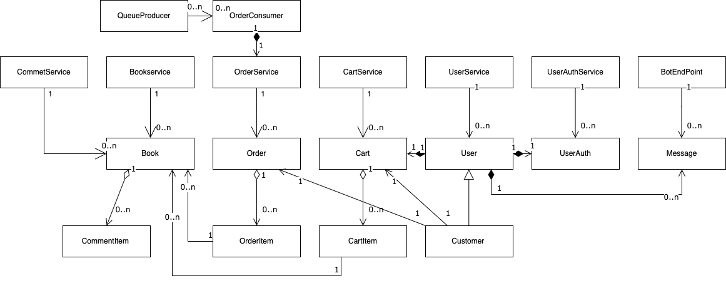
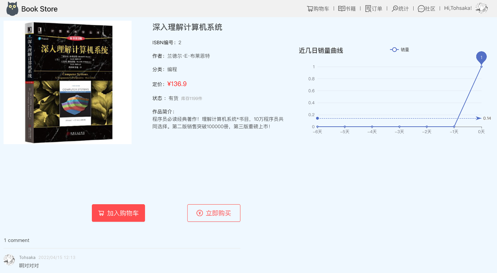
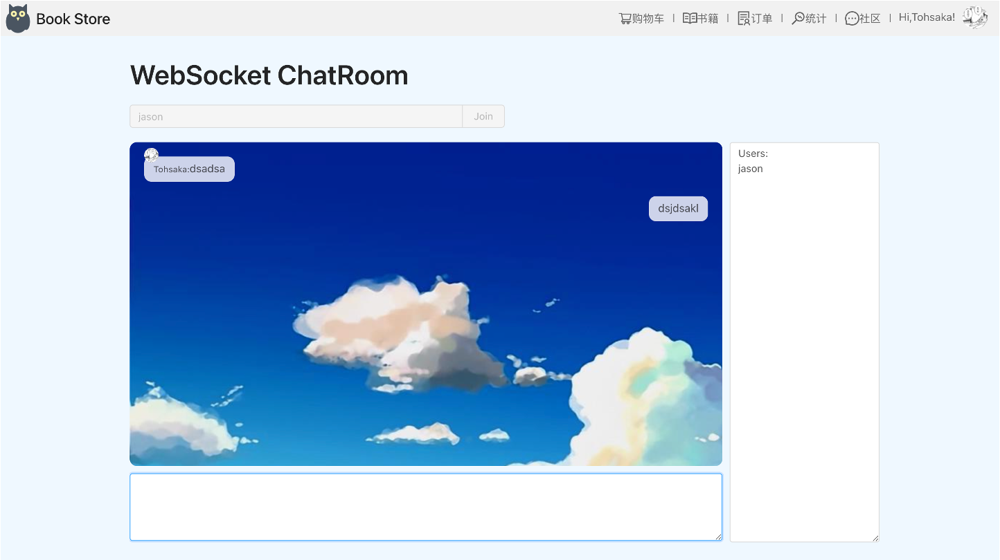
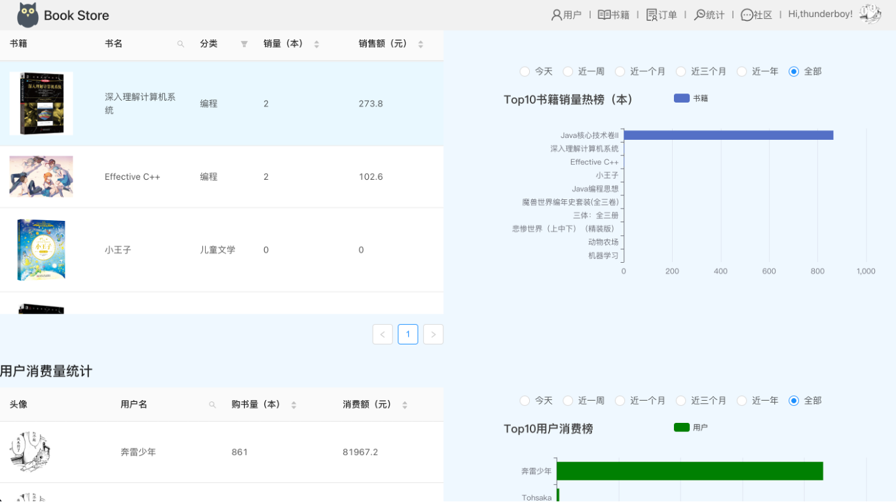

# E-Bookstore
EE458-1：软件工程 第2小组课程项目（React & Springboot）。

一款`完整、高效、多功能`的网上电子书城系统。

在顾客端，实现了：注册登陆，个人信息管理，书籍查找，添加购物车，下订单，订单统计，评论与聊天等功能需求。

在管理员端，实现了：整体订单统计，上传、修改书籍信息，全局订单统计，评论与聊天等功能需求。

项目的类和类间关系如下图中所示：

项目的整体特征可以用以下几点来概括：

- 完整性：集成顾客、管理员两种用户类型界面

  

  

- “书城+社区”理念：兼顾评论与聊天功能（Websocket），顾客、商家、管理员之间可以自由交流

  

  

- 用户友好：隐私保护，直观、美观的统计可视化功能，Lucene全文搜索功能

  

- 响应快速：Activemq订单异步处理+Redis内容缓存
